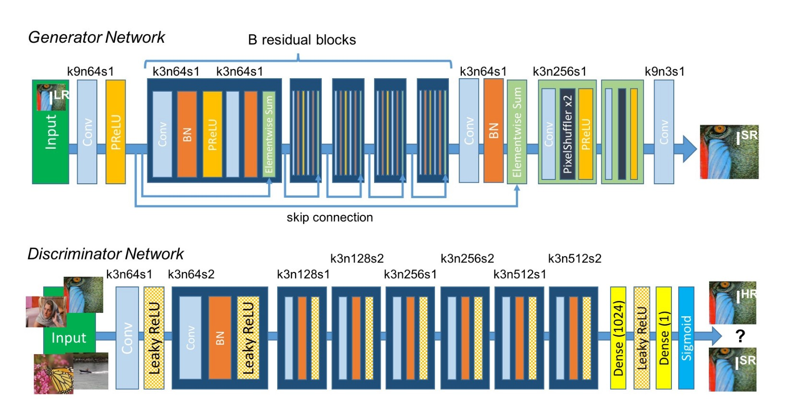
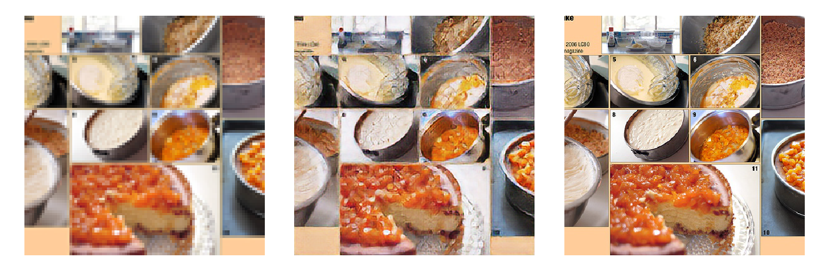
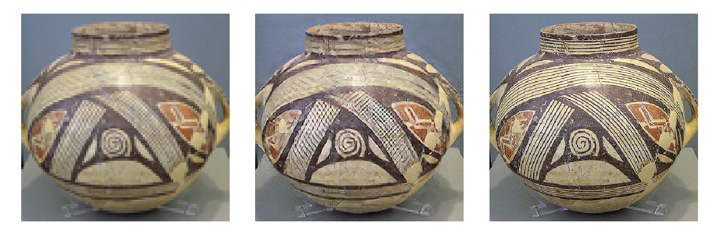
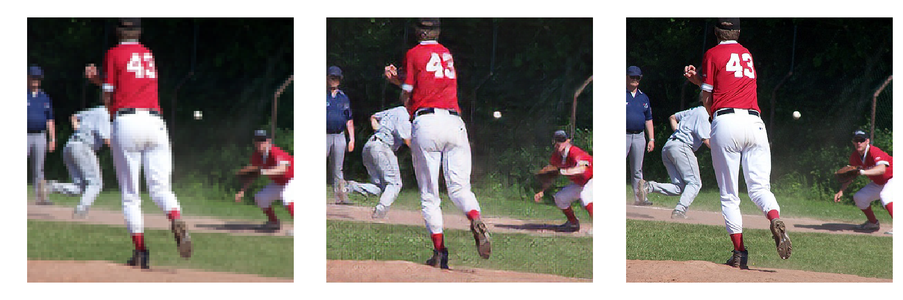

# Keras-SRGAN
Photo-Realistic Single Image Super-Resolution Using a Generative Adversarial Network implemented in Keras

For more about topic check [Single Image Super Resolution Using GANs — Keras](https://medium.com/@birla.deepak26/single-image-super-resolution-using-gans-keras-aca310f33112)

## Problem Statement:
    Enhancing low resolution images by applying deep network with adversarial network (Generative Adversarial Networks) 
    to produce high resolutions images.
    
## Architecture:
    

    
## Generator and Discriminator Network:
    

    
## Network Details:
    * 16 Residual blocks used.
    * PixelShuffler x2: This is feature map upscaling. 2 sub-pixel CNN are used in Generator.
    * PRelu(Parameterized Relu): We are using PRelu in place of Relu or LeakyRelu. It introduces learn-able parameter 
      that makes it possible to adaptively learn the negative part coefficient.
    * k3n64s1 this means kernel 3, channels 64 and strides 1.
    * Loss Function: We are using Perceptual loss. It comprises of Content(Reconstruction) loss and Adversarial loss.
    
## How it Works:
    * We process the HR(High Resolution) images to get down-sampled LR(Low Resolution) images. Now we have both HR 
      and LR images for training data set.
    * We pass LR images through Generator which up-samples and gives SR(Super Resolution) images.
    * We use a discriminator to distinguish the HR images and back-propagate the GAN loss to train the discriminator
      and the generator.
    * As a result of this, the generator learns to produce more and more realistic images(High Resolution images) as 
      it trains.
    
## Documentation:
You can find more about this implementation in my post : [Single Image Super Resolution Using GANs — Keras](https://medium.com/@birla.deepak26/single-image-super-resolution-using-gans-keras-aca310f33112)
    

## Requirements:

    You will need the following to run the above:
    Python 3.5.4
    tensorflow 1.11.0
    keras 2.2.4
    numpy 1.10.4
    matplotlib, skimage, scipy
    
    For training: Good GPU, I trained my model on NVIDIA Tesla P100
    
## Data set:

    * Used COCO data set 2017. It is around 18GB having images of different dimensions.
    * Used 800 images for training(Very less, You can take more (approx. 350 according to original paper) thousand is you can
      collect and have very very good GPU). Preprocessing includes cropping images so that we can have same dimension images. 
      Images with same width and height are preferred. I used images of size 384 for high resolution.
    * After above step you have High Resolution images. Now you have to get Low Resolution images which you can get by down 
      scaling HR images. I used down scale = 4. So Low resolution image of size 96 we will get. Sample code for this.
      
## File Structure:

    Network.py : Contains Generator and Discriminator Network
    Utils.py   : Contains utilities to process images
    Utils_model.py : Contains optimizer and content loss code
    train.py   : Used for training the model
    test.py    : To test the model
    Simplified : This folder contains code without Agrparse etc. If you hate commandline arguements just dive in here.
                 There are just two files. Modify according to requirement and start training.
      
## Usage:
    
    Note : Image shape and downscale factor you can set in train.py file.Set according to requirement.
    
     * Training:
        Run below command to train model. Set parameters accordingly.
        > python train.py --input_dir='./data/' --output_dir='./output/' --model_save_dir='./model/' --batch_size=64 --epochs=3000 --number_of_images=1000 --train_test_ratio=0.8
        
        All Parameters have default values. For mode help on parameters run:
        > python train.py -h
        
     * Testing:
        test.py file contains code to test. Testing can be done in two ways using option test_type:
            1. Test Model- Here you can test the model by providing HR images. It will process to get resulting LR images and then will generate SR images.
               And then will save output file comprising of all LR, SR and HR images.
               Run following command to test model:
               > python test.py --input_high_res='./data_hr/' --output_dir='./output/' --model_dir='./model/gen_model3000.h5' --number_of_images=25 --test_type='test_model'
               For more help run:
               > python test.py -h
               
            2. Test LR images- This option directly take LR images and give resulting HR images.
               Run following command to get HR images from LR images:
               > python test.py --input_low_res='./data_lr/' --output_dir='./output/' --model_dir='./model/gen_model3000.h5' --number_of_images=25 --test_type='test_lr_images'
               For more help run:
               > python test.py -h
          
     If you hate commandline arguements please reffer Simplified folder. Modify parameters in file like image_shape, input folder
     etc. according to your need and start training.
               
## Things's Learned:

    * GAN's sometimes are hard to train. Network can be very deep sometimes, but use of residual blocks make it easier.
    * Once you get to learn about Perceptual loss things get easier. Same Perceptual loss can be usefull for Image Style Transfer and Photo Realistic Style Transfer.
    * This is one of the problem where i struggled to get data. You need to be carefull while choosing data and also preprossing is little bit tough.
    * Better to use images with same width and height.
    * Use GPU for training else it will take months to train(even you can run out of memory).
    
## Output:

Below are few results-

    
More results are in output folder

## Refrences:

    Paper:
    Photo-Realistic Single Image Super-Resolution Using a Generative Adversarial Network: https://arxiv.org/pdf/1609.04802.pdf
    Perceptual Losses for Real-Time Style Transfer and Super-Resolution: https://cs.stanford.edu/people/jcjohns/papers/eccv16/JohnsonECCV16.pdf
    
    Projects doing the same thing:
    https://github.com/MathiasGruber/SRGAN-Keras
    https://github.com/titu1994/Super-Resolution-using-Generative-Adversarial-Networks
    https://github.com/eriklindernoren/Keras-GAN/tree/master/srgan
    https://github.com/brade31919/SRGAN-tensorflow
    https://github.com/tensorlayer/srgan
     
    Help on GANS:
    https://github.com/eriklindernoren/Keras-GAN (Various GANS implemented in Keras)
    https://github.com/JGuillaumin/SuperResGAN-keras
    https://oshearesearch.com/index.php/2016/07/01/mnist-generative-adversarial-model-in-keras/
    
    VGG loss help:
    https://blog.sicara.com/keras-generative-adversarial-networks-image-deblurring-45e3ab6977b5
    
    SubpixelConv2D(Deconvolution) help:
    Real-Time Single Image and Video Super-Resolution Using an Efficient Sub-Pixel Convolutional Neural Network: https://arxiv.org/abs/1609.05158
    https://github.com/twairball/keras-subpixel-conv
    
    Improved Techniques for Training GANs:
    https://arxiv.org/abs/1606.03498
    

               
